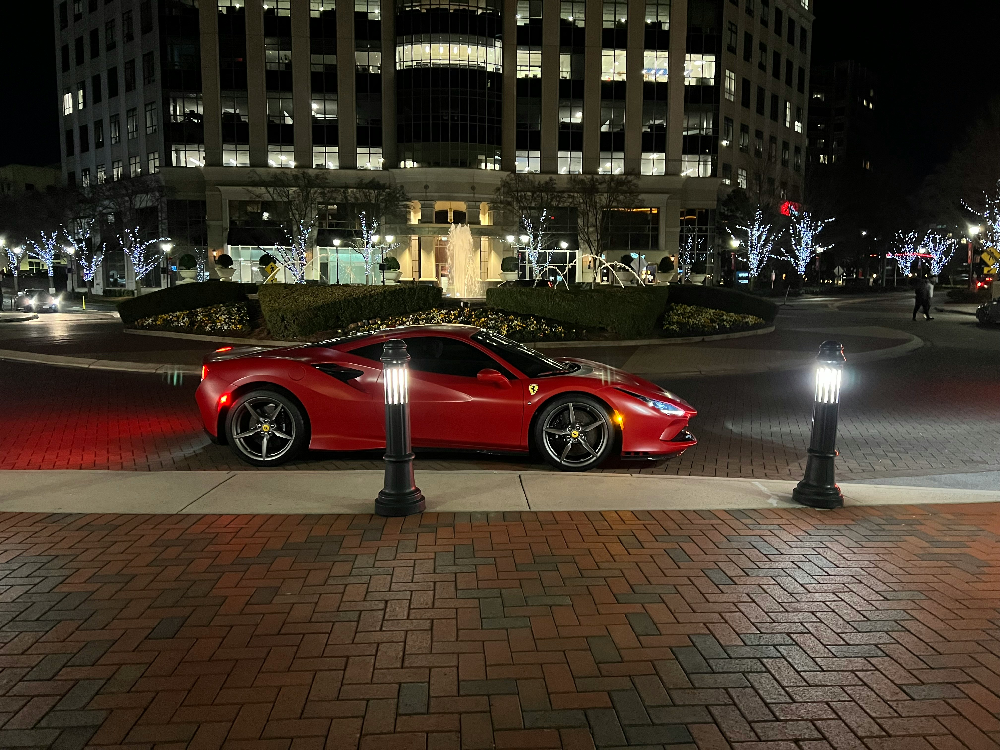

# Vehicles

## Cars

There are different types of Italian supeercars:  

### 1. Lamborghini
This is the fast one, Italian spec.  
These are made by [Lamborghini](https://www.lamborghini.com/en-en), or for non-enthusiasts [Kit cars](https://www.duraflex-racing.com/lamborghini-replicas) will do.

### 2. Ferrari  
Ferrari are also Italian but look like this:  


### 3. Motorcycles  
The fastest of the Italian vehicles is the superbike, examples are:

- Aprilia
  - RSV4
- Ducati
  -  Paniagle


  > This is an example from elsewhere


## Codes

`hello`

```
multi line codes inside 
these 
three dactics
```

```python
print("Hello World!")
```

```js
console.log("Hello World")
```

finally push dat git
